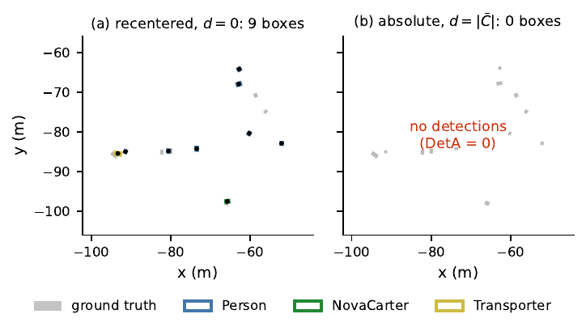
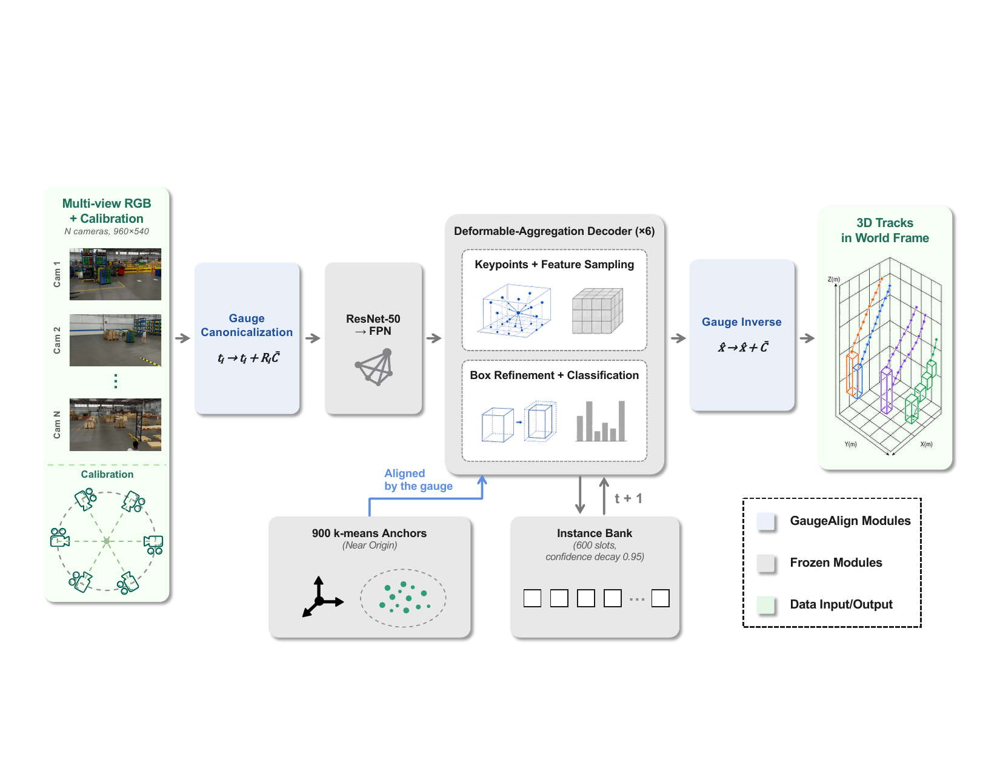
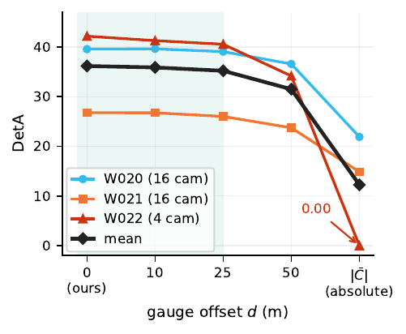
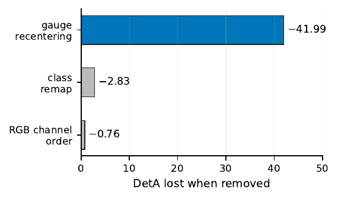
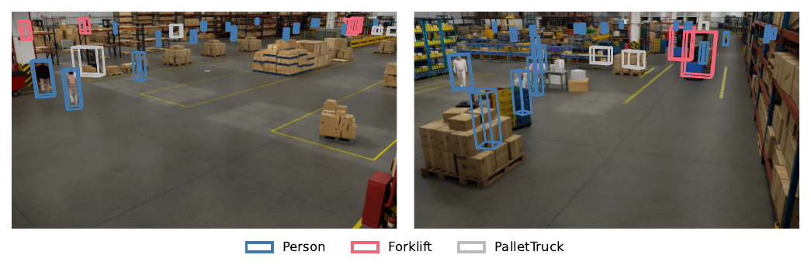

<div align="center">

# GaugeAlign

**The Winning Solution for Track 1 of the 2026 AI City Challenge: Gauge Canonicalization for Multi-Camera 3D Perception**

🏆 **1st place** — AI City Challenge 2026, Track 1 (Multi-Camera 3D Perception, Sim2Real)

[](https://www.aicitychallenge.org/)
[](docs/RESULTS.md)
[](LICENSE)

Xianjin Wu\*, Heng Fang\*, Xuanyang Xi, Yiping Tang, Di Xu, Xiang Bai, Dingkang Liang<sup>✉</sup>

Huazhong University of Science and Technology · Huawei Technologies



*Same detector, same weights, same images. Only the world origin differs.*

</div>

---

## TL;DR

The sim-to-real literature blames the transfer gap on **appearance**. We found a setting where
the dominant term is **geometric**.

Query-based multi-view 3D detectors seed their decoder with *learned spatial priors* — Sparse4D
uses 900 $k$-means anchor boxes whose centres are stored in the **training world frame**. That
frame is a site convention, and transfer does not preserve it. Move the world origin tens of
metres, as any real deployment does, and every anchor projects outside every camera frustum:
a strong pretrained detector emits **zero detections** across an entire four-camera sequence,
peak confidence ≈ 0.03.

We call this the **anchor–gauge coupling**, formalize it as a loss of translation equivariance,
and fix it at inference time with a closed-form, label-free, exactly-invertible canonicalization
operator:

$$\bar{C} = \tfrac{1}{N}\sum_i \left(-R_i^\top t_i\right), \qquad t_i' = t_i + R_i\bar{C}, \qquad \text{predictions} \mathrel{+}= \bar{C}$$

That is the whole thing. It needs only calibration, touches no weights, and the round trip is
exact to $<10^{-6}$ m.

> **Honest framing, up front.** The rank-1 result uses the **public NVIDIA TAO Sparse4D
> checkpoint, frozen** — we trained nothing for it. The contribution is the diagnosis and the
> alignment framework, not a new backbone. We think that is the more useful result: the same
> 5-line fix applies to any detector carrying a world-coordinate prior. Fine-tuning was tried and
> made things **worse** ([docs/EXPERIMENTS.md](docs/EXPERIMENTS.md#4-why-naive-fine-tuning-collapses)).

## How it works

<div align="center"></div>

GaugeAlign aligns three interfaces between a pretrained detector and a target site, all at
inference time, all driven by calibration:

| module | what it aligns | measured effect | where |
|:--|:--|--:|:--|
| **Scene canonicalization** | the coordinate gauge | **+23.91 DetA** | mean over 3 val scenes (36.16 vs 12.25) |
| **Protocol alignment** | the class taxonomy (0→0, 1→4, 2→5, 3→2, 4→3, 5→1, 6→6) | +2.83 DetA | Warehouse_022 |
| **Temporal prior adaptation** | the tracker's occlusion horizon (λ: 0.8 → 0.95) | +0.54 HOTA | full hidden test set |

The first is the contribution; the other two are protocol corrections reported for completeness.
On the one scene where all three are measured head to head, canonicalization outweighs the largest
of them by ≈ **15×** — and on that scene removing it drops detection not by a margin but to
**exactly zero**.

It is **exactly invertible** ($<10^{-6}$ m round trip), so scoring is invariant to the frame and
the operator cannot leak target information; **label-free**, since C̄ needs only extrinsics; and
**plug-in**, touching only the calibration input and the prediction output — which is why any
measured difference is attributable to the gauge alone. Cost is one $O(N)$ transform per scene and
one vector addition per box.

## Results

Final **full** hidden test set (100%), official server, online track:

| rank | team | HOTA | DetA | AssA | LocA |
|:----:|:-----|-----:|-----:|-----:|-----:|
| **1** | **EVA (ours)** | **56.54** | **55.64** | 49.39 | **79.56** |
| 2 | SKKU-AL-T1 | 52.01 | 45.31 | *56.50* | 76.24 |
| 3 | Playbox | 38.01 | 40.26 | 31.10 | 75.18 |
| 4 | QDTers | 34.18 | 29.47 | 33.11 | 17.68 |
| 5 | TU-YMLab | 25.88 | 26.52 | 30.62 | 69.70 |

The +4.53 margin is **entirely a detection margin** (DetA +10.3). Our association is 7.1 points
*worse* than the runner-up — exactly what the diagnosis predicts, and we say so in the paper
rather than hiding it. See [docs/RESULTS.md](docs/RESULTS.md) for every scored configuration.

### The alignment is causal, not incidental

A strong pretrained detector at the top of a leaderboard leaves open whether our part mattered.
Two single-variable studies settle it — everything held fixed except the world frame:

<div align="center"> </div>

| offset $d$ from canonical gauge | 0 m | 10 m | 25 m | 50 m | $\|\bar{C}\|$ (absolute) |
|:--|--:|--:|--:|--:|--:|
| mean DetA over 3 val scenes | **36.16** | 35.87 | 35.20 | 31.49 | 12.25 |
| Warehouse_022 (4 cameras) | 42.16 | 41.27 | 40.54 | 34.16 | **0.00** |

Reverting the alignment costs **two thirds** of detection accuracy and collapses the four-camera
scene to nothing. It is also *tolerant*: flat within 25 m of the canonical gauge, so the exact
choice of centre does not matter — the median camera position or a frustum centroid would serve
equally well.

Qualitatively, with canonicalization active the detector recovers the vehicle classes almost
completely across the full ~100 m extent:

<div align="center"></div>

World-frame predictions projected back into two of 16 cameras with the site calibration — which
also confirms the inverse transform is consistent with the site's own coordinates. No image-space
supervision and no per-camera tuning are involved.

## Quickstart

```bash
git clone https://github.com/HyperbolicCurve/GaugeAlign-AICity2026.git
cd GaugeAlign-AICity2026

bash scripts/setup_tao_backend.sh    # NVIDIA TAO backend @ Release/7.0.1 + our patch
bash scripts/setup_trackeval.sh      # local 3D-HOTA evaluation

export DATASET_ROOT=/path/to/MTMC_Tracking_2026     # docs/DATA.md
export NGC_MODEL_DIR=/path/to/sparse4d_rn50_v2.2    # docs/INSTALL.md

bash scripts/reproduce_cd95.sh       # -> work/track1.zip, the rank-1 submission
```

Full setup in [docs/INSTALL.md](docs/INSTALL.md); the exact recipe, hyper-parameters and
per-scene shift values in [docs/REPRODUCE.md](docs/REPRODUCE.md).

Inspect the canonicalization on any scene without running the model:

```bash
python gaugealign/scene_center.py --dataset_root $DATASET_ROOT --split test
#   scene             cams    shift_x    shift_y   |C-bar|
#   Warehouse_023       20   -43.5309   -50.9003     66.98
#   ...
```

## What is in here

```
gaugealign/            the method
  build_pkl.py           canonicalization: t_i' = t_i + R_i*C-bar, + frame decode
  run_infer.py           frozen detector, gauge inverse, class remap, temporal prior
  scene_center.py        C-bar from calibration alone (standalone, no model needed)
  floor_roi.py           geometric floor-ROI filter
  postproc.py            causal post-processing stages (all optional, none shipped)
  make_submission.py     validate + package track1.zip
  assoc/                 CVC-Assoc: our learned per-instance survival gate
                         (exploratory — failed its own val gate, NOT submitted)
scripts/
  reproduce_cd95.sh      the rank-1 submission, end to end
  gauge_stress.sh        the stress curve   + gauge_score.py
  unlock_factorial.sh    the unlock factorial + factorial_score.py
  prefix_check.py        online / causality test
  evaluate_hota*.py      local 3D-HOTA (dev metric, not the official server)
  setup_*.sh             third-party fetch + patch
patches/                 our diff against NVIDIA TAO @ Release/7.0.1
configs/                 gaugealign_cd95.yaml (the winning config) + scenes.yaml
docs/                    INSTALL · DATA · REPRODUCE · EXPERIMENTS · RESULTS
```

## Reproducing the analysis

| study | paper | command |
|:--|:--|:--|
| Gauge stress curve | Sec. 4.3, Tab. 3 | `bash scripts/gauge_stress.sh` → `python scripts/gauge_score.py` |
| Unlock factorial | Sec. 4.3, Tab. 4 | `bash scripts/unlock_factorial.sh` → `python scripts/factorial_score.py` |
| Online / causality | Sec. 4.1 | `python scripts/prefix_check.py work/pred_test_cd95_26.txt` |
| CVC-Assoc val gate | Sec. 4.5 | [docs/EXPERIMENTS.md](docs/EXPERIMENTS.md#5-cvc-assoc-a-learned-survival-gate) |
| Fine-tuning collapse | Sec. 4.4 | [docs/EXPERIMENTS.md](docs/EXPERIMENTS.md#4-why-naive-fine-tuning-collapses) |

## Limitations

Stated plainly, matching the paper:

- The stress test sweeps **translations only**, on three validation scenes. Rotation
  canonicalization is untested.
- The coupling is demonstrated on **one anchor-seeded detector family** and one benchmark. We
  *expect* BEV-grid and learned-reference-point priors to behave the same; we do not show it.
- Hidden-test scores **mix synthetic and real** scenes, so we make no real-only claim.
- The fine-tuning failure is **not fully disentangled** from its training recipe (learning rate is
  causal and shown; the background-loss arm is confounded and flagged as a hypothesis).
- **Association is our weak axis** and resisted every label-free lever we tried.

## Citation

```bibtex
@inproceedings{wu2026gauge,
title={The Winning Solution for Track 1 of the 2026 AI City Challenge: Gauge Canonicalization for Multi-Camera 3D Perception},
author={Xianjin Wu and Heng Fang and Xuanyang Xi and Yiping Tang and Di Xu and Xiang Bai and Dingkang Liang},
booktitle={Towards Sim2Real Transfer and Unified Reasoning: 10th AI City Challenge},
year={2026},
}
```

## Acknowledgements & licensing

Our code is MIT. It stands on third-party work that keeps its own terms — the
[NVIDIA TAO PyTorch backend](https://github.com/NVIDIA/tao_pytorch_backend) (Apache-2.0), the
frozen [TAO Sparse4D](https://catalog.ngc.nvidia.com/orgs/nvidia/teams/tao/models/sparse4d_rn50)
checkpoint (NVIDIA Open Model License), the challenge data (CC-BY-4.0), and the
[TrackEval](https://github.com/JonathonLuiten/TrackEval) fork released by the 2025 Track 1
winners, [ZIOVISION](https://github.com/ZIOVISION/AIC2025_Track1_ZV). We ship a patch rather than
a copy of NVIDIA's code so provenance stays clear. Details in [NOTICE](NOTICE).

Thanks to the AI City Challenge organizers for the benchmark, and to the 2025 top teams for
releasing code that made local evaluation possible.
