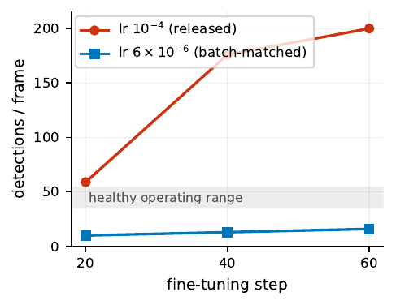
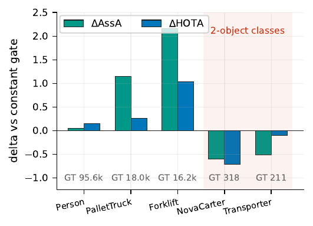

# Experiments

How to re-run each study in the paper, and what it showed. Headline numbers are collected in
[RESULTS.md](RESULTS.md); this page is about method and interpretation, including the parts that
did not work.

All studies below use the **validation** scenes (Warehouse_020/021/022 — 16, 16 and 4 cameras)
with 150 frames each (`--end 900 --stride 6`) and the local metric. Hidden-test numbers come from
the challenge server and cannot be recomputed offline.

---

## 1. The collapse

The observation the paper is built on. Same weights, same images, same thresholds — only the
world origin differs.

<div align="center"></div>

In the absolute site frame the detector emits **zero boxes over an entire four-camera sequence**,
peak classification confidence ≈ 0.03. It is not degraded; it is silent.

The cause is mechanical. Sparse4D seeds its decoder with 900 $k$-means anchors whose centres live
in the training world frame. At each layer, keypoints from the current box estimate are projected
into every view, $u_{ik} = \pi(K_i(R_i x_k + t_i))$. Under a gauge translation by $d$ the argument
becomes $R_i(x_k - d) + t_i$: shifting the frame shifts every anchor by $-d$ relative to the
scene. Because the anchor set is a network constant, once $|d|$ exceeds the scene extent every
keypoint leaves every frustum, feature sampling returns background, and a *local* box refinement
cannot recover a displacement of the whole scene.

See it yourself, no GPU needed:

```bash
python gaugealign/scene_center.py --scene_dir $DATASET_ROOT/val/Warehouse_022 \
                                  --anchor $NGC_MODEL_DIR/_ov_kmeans900_v2.2_r50.npy
```

---

## 2. Gauge stress curve

**Paper**: Sec. 4.3, Table 3, Fig. 5 (left). **Result**: [RESULTS.md](RESULTS.md#gauge-stress-curve--the-alignment-is-necessary-and-tolerant).

```bash
DATASET_ROOT=... NGC_MODEL_DIR=... bash scripts/gauge_stress.sh
python scripts/gauge_score.py
```

Sweeps exactly one variable: the world-frame offset $d$ along $-\hat{\bar{C}}$, so $d=0$ is the
canonical gauge and $d = |\bar{C}|$ is naive transfer. Ground truth is **always** scored in the
original absolute frame, so numbers are comparable across the sweep. Frames are decoded once per
scene and shared by every $d$.

Why this design: a strong pretrained detector at the top of a leaderboard leaves open whether our
part mattered at all. Holding literally everything else fixed and moving only the coordinate
convention is the cleanest available answer.

Runtime ~2–3 h on 2× RTX 3090 (15 inference runs over 150 frames).

---

## 3. Unlock factorial

**Paper**: Sec. 4.3, Table 4, Fig. 5 (right). **Result**: [RESULTS.md](RESULTS.md#unlock-factorial--the-gauge-term-dominates-by-15).

```bash
DATASET_ROOT=... NGC_MODEL_DIR=... bash scripts/unlock_factorial.sh   # needs gauge_stress.sh first (for GT)
python scripts/factorial_score.py
```

Crosses canonicalization × colour order × class remap on the four-camera scene. Canonicalization
is a build-time factor (2 pkls); the other two are inference flags (4 runs each) — 8 cells.

Colour order is in there as an honest control: it is an *implementation* detail, not a research
contribution, and including it shows the magnitude of a typical mundane bug (0.76 DetA) against
the gauge term (41.99).

---

## 4. Why naive fine-tuning collapses

**Paper**: Sec. 4.4, Fig. 6 (left).

The obvious alternative to inference-time alignment is to fine-tune on target-year synthetic data.
With the released configuration this **destroys the model**: within tens of steps the detector goes
from ~45 to 200 detections per frame, and over a full run Person DetA falls from 48.9 to 1.2.

<div align="center"></div>

**Learning rate is causal, and we show it.** Changing only the rate reproduces the effect:

| step | 20 | 40 | 60 |
|:--|--:|--:|--:|
| lr = 1×10⁻⁴ (released) | 59 | 176 | 200 |
| lr = 6×10⁻⁶ (batch-matched) | 10 | 13 | 16 |

The released rate was calibrated for a global batch of **128**. At our batch of **4**, linear
scaling puts the appropriate rate ~32× lower. The released rate runs away; the batch-matched rate
stays in the healthy operating band.

**A second factor is plausible but NOT isolated.** The stock set-prediction loss discards unmatched
background queries, removing the gradient that suppresses false positives. Restoring that term cut
first-epoch over-firing by 7.3× (56.9 → 7.8 detections/frame at threshold 0.2) and let a full
fine-tune hold Person accuracy near baseline — but that arm also differs in rate, data mix and
regularization, so we flag it as a **hypothesis, not a finding**. The optional loss term is in the
patch (`criterion.py`) and is off by default.

Even at a batch-matched rate, deeper fine-tuning eroded strong classes faster than it improved rare
ones. **No fine-tuned weights entered the final system.** The alignment is exact and attributable;
the training route is fragile at practical batch sizes and needs labeled target-domain data that
deployment does not provide.

---

## 5. CVC-Assoc: a learned survival gate

**Paper**: Sec. 4.5, Fig. 6 (right). Code: [`gaugealign/assoc/`](../gaugealign/assoc/).

This is our own architectural addition, and it is reported as **exploratory** because it failed its
own acceptance gate. It was **not** part of the rank-1 submission.

### Motivation

GaugeAlign repairs detection; association is where we trail (AssA 49.39 vs the runner-up's 56.50).
The instance bank decays an unmatched instance's confidence by a *constant* λ. Replacing that
constant with a **state-dependent** gate is the natural learned upgrade.

### Design

A small MLP inside the instance bank predicts a per-instance survival gate $g \in (0.81, 0.99)$,
from a 59-dimensional feature per bank slot:

| block | dims | contents |
|:--|--:|:--|
| temporal state | 6 | prev/current confidence, logit, Δconf, age, time gap |
| 3D geometry | 9 | X, Y, Z, log W/L/H, sin/cos yaw, speed |
| cross-view consensus | 12 | 5 consensus scalars vs an independent RT-DETR 2D detector + class one-hot |
| identity | 32 | frozen random projection of the 256-d instance embedding |

Full design and causal-safety argument: [CVC_ASSOC_DESIGN.md](CVC_ASSOC_DESIGN.md).

**As-built caveat:** three of the 59 inputs — age, time gap and speed — are **zero-filled** in the
shipped head (marked `TODO(cvc)` in `cvc_assoc_head.py`). The gate therefore learns from 56
informative dimensions. We leave the placeholders in rather than quietly shrinking the feature
vector, because the trained checkpoint we release was fitted with them present.

Two properties make it **regression-safe by construction**:

1. **Bit-exact init.** The final layer is initialized so $g \equiv \lambda$ in float32 — the head
   at initialization is byte-identical to the constant-decay path, so it cannot silently perturb a
   top-*k* tie.
2. **Gated checkpointing.** Training only saves a checkpoint if the learned gate beats the constant
   on *scene-disjoint* held-out data.

Only the MLP trains; the detector stays frozen. Supervision comes from matching the bank's emitted
instances to ground-truth tracks over eight training scenes. Strictly causal — current and past
frames only.

### Outcome

Held-out survival-prediction AUC rose from 0.500 (constant baseline) to **0.9965**. The underlying
cross-view signal is real too: measured against the independent RT-DETR detector, cross-view
agreement separates true from false boxes with **AUC 0.873** (0.892 in the low-confidence band).

On local HOTA over frames 0–899 of the validation scenes:

| class | GT objects | ΔAssA | ΔHOTA |
|:--|--:|--:|--:|
| Forklift | many | **+2.16** | **+1.04** |
| PalletTruck | many | +1.15 | +0.26 |
| Person | many | +0.05 | +0.15 |
| NovaCarter | 2 | — | **−0.71** |
| Transporter | 2 | — | −0.10 |
| class-average HOTA | | | 23.19 → 23.29 |

<div align="center"></div>

It improves **every well-populated class** and regresses the two classes with only **two objects
present**, where a single identity flip dominates the class metric. That violated our per-class
no-regression criterion, so it was not submitted.

We read this as: a learnable survival signal exists but is **population-limited** — the gate helps
exactly where the labels are dense enough to learn from. Three caveats, stated in the paper: the
evaluation covers one tenth of the sequence with temporally correlated samples, it is not
confirmed on the hidden test set, and the gate's output range is fixed by its parameterization.

### Running it

The gate is off unless explicitly enabled, so this changes nothing by default.

```bash
# 1. cache 2D detections from the independent detector (consensus features)
# 2. dump survival labels by matching bank instances to GT tracks
python gaugealign/assoc/cvc_label_targets.py --help
# 3. train the MLP (saves only if it beats the constant on held-out scenes)
python gaugealign/assoc/cvc_train_head.py --help
# 4. inference with the gate
python gaugealign/run_infer.py ... --cvc_head gaugealign/assoc/cvc_head_trained.pt \
                                   --cvc_dets <dets.json> --cvc_calib <calibration.json>
# 5. the val gate that rejected it
python gaugealign/assoc/cvc_valgate_eval.py
```

Trained weights ship with the repo: `cvc_head_trained.pt` (137 KB) and `cvc_head_init.pt`, the
latter being the bit-exact constant-decay equivalent used to verify property (1).

---

## 6. The hand-crafted consensus rule (negative)

Before the learned gate we tried a fixed rule: re-weight the instance memory by cross-view
agreement, so identities many cameras agree on survive longer. The signal is real (AUC 0.873), but
as a *survival rule* it was net-negative on the hidden test set — 56.35 on one scene and 56.13 on
all three synthetic scenes, against the 56.54 baseline, with aggregate AssA falling 49.39 → 49.13.

The likely reason: a fixed threshold **over-merges when many views vote**, injecting identity
switches into the memory. A real signal used through the wrong decision rule.

The implementation is in the patched `instance_bank.py` (`enable_ccs`), off by default and mutually
exclusive with the learned gate.

---

## 7. Why recall recovery is hopeless here

Two post-processing ideas tried to recover detections that the score threshold drops while the
instance bank still holds the identity:

- **Gap interpolation** — reads future frames, forfeits online status, discarded (and did not beat
  the baseline anyway: 56.38 vs 56.54).
- **Confidence hysteresis** — its causal replacement. Regressed validation DetA at *every* setting
  (best −0.21, worst −0.90).

The reason is a property of the detector, not of the gate: **below the operating threshold the
output is overwhelmingly false — roughly 160 false positives per true positive in the 0.05–0.2
band.** No gate can recover recall from a tail that contains almost nothing true.

This is why we conclude the remaining association headroom needs signals the detector does not
provide, such as a trained appearance re-identification head — and why we did not keep grinding on
post-processing.

---

## 8. Verifying the online property

```bash
python scripts/prefix_check.py work/pred_test_cd95_26.txt
```

See [REPRODUCE.md](REPRODUCE.md#verify-the-online-property). The short version: the test compares
post-processing a truncated sequence against truncating the post-processed full sequence, and it
includes a stage (`gapfill`) that is *expected to fail*, so a pass means something.
