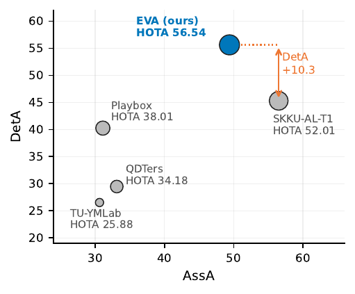
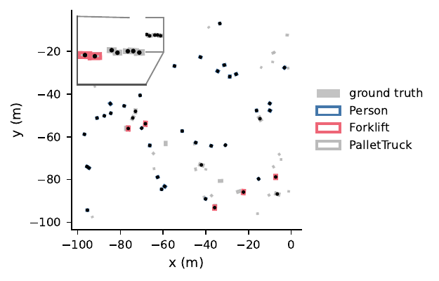

# Results

All hidden-test numbers come from the **official challenge evaluation server**. We report the
**final full (100%) test set**, which determines the ranking. Numbers scored before the deadline
were on a 50% public split and are noted only where the two disagree.

## Final leaderboard — Track 1, online

| rank | team ID | team | online | HOTA | DetA | AssA | LocA |
|:--:|:--:|:--|:--:|--:|--:|--:|--:|
| **1** | 289 | **EVA (ours)** | Yes | **56.5447** | **55.6444** | 49.3929 | **79.5558** |
| 2 | 34 | SKKU-AL-T1 | Yes | 52.0118 | 45.3056 | *56.5047* | 76.2410 |
| 3 | 130 | Playbox | Yes | 38.0105 | 40.2592 | 31.0978 | 75.1778 |
| 4 | 4 | QDTers | Yes | 34.1845 | 29.4663 | 33.1122 | 17.6841 |
| 5 | 133 | TU-YMLab | Yes | 25.8837 | 26.5196 | 30.6221 | 69.6980 |
| 6 | 149 | Calix | Yes | 19.5412 | 18.6826 | 18.6161 | 60.0886 |
| 7 | 293 | mytm | Yes | 16.6359 | 16.1613 | 16.6352 | 61.6538 |
| 8 | 260 | Anonymous | Yes | 14.8386 | 15.1023 | 15.0593 | 60.1948 |
| 9 | 127 | Team KODE | Yes | 12.4128 | 14.5213 | 11.8109 | 57.0038 |
| 10 | 97 | SMART Lab | Yes | 12.3778 | 14.5214 | 11.7634 | 57.0038 |

*Left: the top five as DetA against AssA, marker area ∝ HOTA — we lead on detection and trail on
association. Right: bird's-eye view on Warehouse_020 (16 cameras, busiest frame) with
canonicalization active; grey is ground truth, coloured outlines are predictions. On this frame
10 of 10 PalletTrucks and 7 of 9 Forklifts are recovered; the residual misses concentrate in the
dense Person class, where recall is limited by the low-confidence tail (see
[EXPERIMENTS.md](EXPERIMENTS.md#7-why-recall-recovery-is-hopeless-here)).*

**The margin is a detection margin.** +4.53 HOTA over the runner-up decomposes into **DetA
+10.34** and **AssA −7.11**. A system that differs from its base detector only by geometric
alignment wins on the detection axis and loses on association — which is what the diagnosis
predicts. We do not claim a better tracker; we claim the detector was never broken, only
mis-framed.

## Every scored configuration

Upper block is the submitted progression; each row changes **one** variable against a named
control. Lower block is what we explored and rejected.

| configuration | DetA | AssA | LocA | HOTA |
|:--|--:|--:|--:|--:|
| GaugeAlign base (canonicalization + protocol) | 54.94 | 49.15 | 79.46 | 56.00 |
| + temporal adaptation λ = 0.9 | 55.34 | 49.38 | 79.49 | 56.37 |
| **+ temporal adaptation λ = 0.95 — submitted, rank 1** | **55.64** | **49.39** | **79.56** | **56.54** |
| *explored / discarded* | | | | |
| per-class row-select ensemble | 55.07 | 49.46 | 79.56 | 56.33 |
| cross-view consensus rule, one scene | 55.31 | 49.37 | 79.48 | 56.35 |
| cross-view consensus rule, all synthetic scenes | 55.17 | 49.13 | 79.47 | 56.13 |
| gap interpolation + NMS — **non-causal**, discarded | 55.21 | 49.44 | 79.58 | 56.38 |
| size-prior variant — **flawed** | 51.20 | 49.90 | 77.50 | 53.78 |
| monocular 2D baseline — offline | 4.86 | 16.01 | 46.66 | 7.98 |

Reading of the trail:

- **Canonicalization + protocol alignment alone reaches 56.00**, already 3.99 above the runner-up.
  Everything after it is worth ≤ 0.54 combined.
- **λ helps slightly and is split-dependent.** On the 50% development split the ordering *flipped*
  (λ=0.9 → 58.92, λ=0.95 → 58.73); on the full set λ=0.95 wins. Within ~0.2 HOTA either way, i.e.
  split noise. We shipped 0.95 and say so rather than presenting it as a tuned gain.
- **The cross-view consensus rule is net-negative** on both splits (56.35 / 56.13 vs 56.54).
  Reported, not buried — see [EXPERIMENTS.md](EXPERIMENTS.md#5-cvc-assoc-a-learned-survival-gate).
- **The flawed size-prior run (53.78)** was submitted before the no-regression check was in place.
  It is the reason the check exists. No configuration that passed the check ever fell below the
  baseline.
- **Gap interpolation tied and was still dropped** (56.38 < 56.54 anyway) because it reads future
  frames.

## Controlled studies (validation scenes, local metric)

These use the local TrackEval-based metric, not the server. Three scenes, 150 frames each
(`--end 900 --stride 6`), all model state fixed.

### Gauge stress curve — the alignment is necessary and tolerant

Per-class-averaged DetA as the world frame is displaced by *d* metres. *d*=0 is the canonical
gauge; *d*=|C̄| is the absolute site frame of naive transfer.

| scene (cameras) | *d*=0 | *d*=10 | *d*=25 | *d*=50 | *d*=\|C̄\| |
|:--|--:|--:|--:|--:|--:|
| Warehouse_020 (16) | 39.56 | 39.61 | 39.06 | 36.57 | 21.90 |
| Warehouse_021 (16) | 26.77 | 26.74 | 26.01 | 23.73 | 14.86 |
| Warehouse_022 (4) | 42.16 | 41.27 | 40.54 | 34.16 | **0.00** |
| **mean DetA** | **36.16** | 35.87 | 35.20 | 31.49 | 12.25 |
| mean HOTA | 44.93 | 44.52 | 44.16 | 40.66 | 19.09 |

- **Necessary**: absolute coordinates cost two thirds of mean DetA, and the four-camera scene
  produces *no valid detections at all*.
- **Tolerant**: under one point of movement out to 25 m. Since C̄ is only a calibration-derived
  estimate of an unknown ideal centre, this is what makes the choice of centre uncritical — the
  median camera position or a frustum centroid would do as well.

Two caveats we state in the paper: the sweep samples **one translation direction**, and the higher
retention of the 16-camera scenes at absolute coordinates is a correlation across three scenes
with different content, **not** a controlled camera-count experiment.

Reproduce: `bash scripts/gauge_stress.sh && python scripts/gauge_score.py`

### Unlock factorial — the gauge term dominates by ~15×

Warehouse_022, 150 frames, per-class-averaged.

| canonicalization | colour | remap | dets/frame | DetA | HOTA |
|:--:|:--:|:--:|--:|--:|--:|
| ✓ | BGR | ✓ | 5.7 | **41.99** | **47.20** |
| ✓ | BGR | — | 5.6 | 39.17 | 46.16 |
| ✓ | RGB | ✓ | 5.6 | 41.23 | 46.49 |
| ✓ | RGB | — | 5.6 | 38.25 | 45.39 |
| ✗ (absolute) | any | any | 0.0 | 0.00 | 0.00 |

All four un-canonicalized cells emit **zero** detections. With it on, removing the class remap
costs 2.83 DetA and the wrong colour order 0.76 (roughly additive, −3.74). So the gauge term
outweighs the largest protocol correction by 41.99 / 2.83 ≈ **14.8×**.

Honest limit: because the absolute condition collapses completely on this scene, the factorial
**cannot grade the protocol effects under absolute coordinates**. It establishes dominance of the
gauge term; the stress curve corroborates it across three scenes.

Reproduce: `bash scripts/unlock_factorial.sh && python scripts/factorial_score.py`

## Things that did not work

Kept here deliberately — the negative results are load-bearing for the paper's argument.

| idea | outcome |
|:--|:--|
| Cross-view consensus survival rule (hand-crafted) | **negative** on both splits (56.35 / 56.13 vs 56.54) despite a real underlying signal (AUC 0.873 vs an independent 2D detector) |
| CVC-Assoc learned survival gate | aggregate-positive but **failed the per-class no-regression gate** → not submitted |
| Fine-tuning on target-year synthetic data | **collapse**: 45 → 200 detections/frame in tens of steps; Person DetA 48.9 → 1.2 |
| Confidence hysteresis (recall recovery) | regressed validation DetA at every setting (−0.21 best, −0.90 worst) |
| Gap interpolation | tied (56.38) but **non-causal** → discarded |
| Size-prior snapping | −2.76 HOTA (53.78) |

Detail and diagnosis for each: [EXPERIMENTS.md](EXPERIMENTS.md).

## A note on metrics

`scripts/evaluate_hota.py` (TrackEval fork, 2026 class list) averages over **all seven** classes,
scoring classes absent from a scene as 0 — convenient for like-for-like ablation comparisons but
not the official metric. `scripts/evaluate_hota_present.py` implements the official aggregation:
per-scene mean over the classes actually **present** in that scene's GT, weighted across scenes by
object count. Neither is the challenge server; every headline number on this page is.
